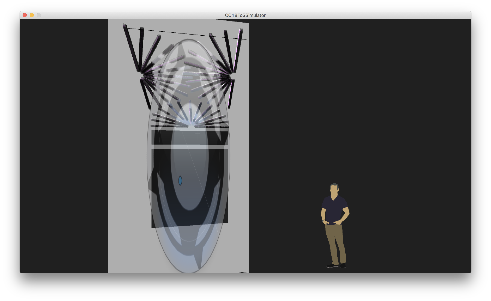

# Temple of Science

The Temple of Science is an installation at Country Club 2018 in the two story
art cabin.  It combines projection and LEDs in a sychronized display.

The LEDs are leftovers from 
[Matt Mets' Crystal Archway](https://www.evilmadscientist.com/2013/making-at-maker-faire/)
they are housed in aluminum U-channel with diffuser. 

# Components

## SketchUp Model

The two story cabin is modeled in Design/ArtCabin.skp.  The LEDs are installed in
the cabin.  Once surface of each LED strip is colored a specific pink which is
picked up by the builder.

## Builder

The builder (Utilities/CC18ToSBuilder) takes the SketchUp model (converted to 
OBJ) and createsa Moonpaper compatible JSON file describing where in space the
LEDs are.

The builder is interactive.  Use the mouse to click on an LED strip and the
arrows to reorder until the strips are in the order appropriate for being 
addressed by the controllers. Press S to save.

## Simulator

The simulator lives under Utilities/CC18ToSSimulator.  Run it and the 
transmitter to get a preview of the installation.

The simulator also takes frames from [Syphon](http://syphon.v002.info) and
displays them on the front of the cabin.

## Transmitter

The transmitter (Routines/CC18ToSTransmitter) runs a single routine that takes
frames from [Syphon](http://syphon.v002.info) and maps them to the LEDs.  

